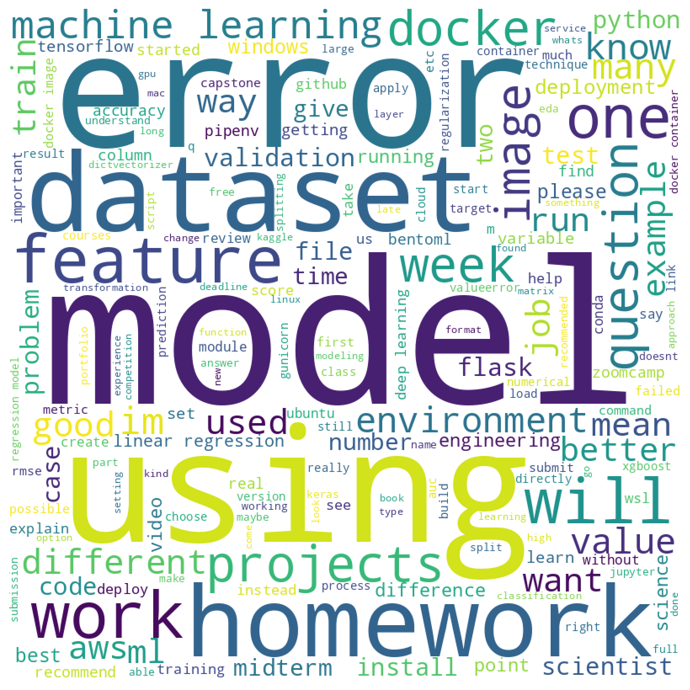

# DataTalks.Club Q&A Navigator: Revolutionizing Information Access with NLP


## Description

The idea for this project came from the 'DTC Zoomcamp Q&A Challenge' that provides a unique dataset with dataset with questions and possible answers and challenge us to create a natural language processing (NLP) model that is capable of matching the question with the correct answer.

I have made my attempt to the challenge and I even wrote an [article](https://danietakeshi.github.io/articles/) and published one of my notebooks on [Kaggle](https://www.kaggle.com/code/dtakeshi/dtc-zoomcamp-q-a-sentence-transformers).

After that I have an idea "What if we could navigate through these answers like we do on Google?", because it is not always easy to find the resources that we are looking for, even if we have the FAQs and the Q&A videos.

With that in mind I came up with a model that can:
- Find the top 3 answers with the highest probability of answering your question using sentence transformers;
- Can be deployed on the cloud with easy steps but it also can be used offline because I have stored the answers embeddings on a parquet file
- Has a web app interface that shows you the answers and the score (cosine similarity)
- Has a compilation o knowledge from the Q&A videos of DataTalks.Club courses and the FAQ maintained by the participants of the courses.

The complete dataset used is a composition of 3 sources:
1. DTC Zoomcamp Q&A Challenge datasets;
2. Machine Learning Zoomcamp FAQ;
3. Data Engineering Zoomcamp FAQ;

With these 3 sources I have build the complete dataset that can be found here [capstone-2-qa-dataset.csv](./code/capstone-2-qa-dataset.csv).

## EDA

### Data Overview
Number of Entries: 1,582
Columns:
- 'course': The name of the course (object type).
- 'year': The year of the course (integer type).
- 'question': The question asked (object type).
- 'answer': The answer provided (object type).

### Frequency Distribution for 'Course':

The dataset includes a balanced distribution across different course categories, with a slight predominance of the Machine Learning Zoomcamp.

Machine Learning Zoomcamp: 502 entries
Data Engineering Zoomcamp: 409 entries
Machine Learning Zoomcamp FAQ: 351 entries
Data Engineering Zoomcamp FAQ: 320 entries


This bar chart displays the total number of questions asked for each course. Key insights include:

- The Machine Learning Zoomcamp has the highest number of questions, followed closely by the Data Engineering Zoomcamp.
- The FAQ sections of both the Machine Learning and Data Engineering Zoomcamps also show a significant number of questions, indicating active engagement in these areas.

### Data Visualization: Distribution of Courses Over the Years

The bar chart below illustrates the distribution of questions across different courses over the years 2021 to 2023. 


Key observations include:

A noticeable increase in the number of questions for all courses from 2021 to 2022.
The Machine Learning Zoomcamp has the highest number of questions in 2022, while Data Engineering Zoomcamp has a substantial presence in 2023.
The distribution shows a relatively balanced mix of questions across the courses each year, with some variation in volume.

### Word Cloud

The word cloud below visualizes the most prominent words found in the questions from the courses containing "Machine Learning," with common stopwords and the specified words ('data', 'think', 'use', 'need', 'project', 'course') excluded.



This visualization highlights the key topics and areas of interest specific to Machine Learning-related questions. It offers a clear insight into the subjects and themes that are particularly relevant or frequently discussed in these courses.

## Model Training

The core concept of my approach is using sentence transformers from HuggingFace using our dataset to train it and fine tunne it with other datasets if necessary.

The first approach that I have used was using the 'all-MiniLM-L6-v2' model with a triplet data structure (question, correct answer and wrong answers) unsing basically only the dataset from the Q&A Challenge and with a TripletLoss loss funtion.

With this approach I reached a 0.8825 accuracy on the test dataset that is a pretty good number, but I knew that it could be improved.

So I use tried to use 2 datasets from HuggingFace to improve my numbers: 'sentence-compression' and 'QQP_triplets'.

The sentence-compression improved a little bit o my results reaching a 0.8901 accuracy. But on the other hand the QQP_triplets to a `really` long time to run and generated a result the non-fine-tunned model.

So I decided to test the MultipleNegativesRankingLoss with a simpler data structure of question and answers and this is the model published on the article that has an accuracy of 0.9469.

I have tried to increase the number of epochs but the increase in time did not pay the waiting time.

My final model uses the 'multi-qa-mpnet-base-dot-v1' as a base sentence transformer and it is trained with the full dataset present on this repository.

>Note: You will have to believe me on this one because I did not make the download my Jupyter Notebook from the Saturn cloud and I am currently out of free hours to dowload it. Fell free to deduct some points from this topic.

## Export to Script

The [Python](./code/train.py) script is designed to build and train a question-answering (Q&A) model using sentence transformers. It reads a dataset of question-answer pairs, trains a model on this data, and then uses the trained model to find the most similar answer to a given question.

1. Data Preparation
- The script expects a [CSV](./code/capstone-2-qa-dataset.csv) file containing question-answer pairs. The CSV file should have columns labeled course, year, question, and answer.
- This file should be placed in the same directory as the script, or the path should be modified accordingly in the script.

2. Training the Model
- The script uses the sentence-transformers library to create a model for encoding sentences.
- It loads the Q&A pairs from the CSV file and creates training examples.
- The model is trained to understand the context of questions and their corresponding answers.

3. Saving the Model
- After training, the model is saved to the specified output file (ml-zoomcamp-qa-sentence-transformer).

4. Finding Answers
- The script demonstrates how to use the trained model to find the most similar answer to a given question.
- The question is encoded along with the candidate answers, and cosine similarity is used to find the most similar answer.

5. Example
To use the script, simply run it with Python after ensuring the dataset is in the correct location. The script will output the most similar answer to the hardcoded question "Is it Possible to use AWS instead of GCP?".

> To test the train.py code by shure to run `pipenv install && pipenv shell` to make sure that you will have all the dependecies ready
> It is recommended to use a machine with a discrete GPU or a jupyter notebook with GPU access because otherwise this script can take a very long time to run

As a way to make the predictions run faster I have created a function that its located on the [test_model_locally.py](./code/test_model_locally.py) called `create_embeddings_db` that stores all the vectors embeddings for the answers on a parquet file.

These simple step can drastically reduce the time needed to run a Q&A prediction.

## Flask API

The [Python](./code/predict.py) script creates a Flask-based web application that serves a Question-Answering (Q&A) API. The API uses a trained Sentence Transformer model to find the most relevant answers to a given question from a pre-defined set of answers.

### Running the Application

1. Place your [trained model](./code/ml-zoomcamp-qa-sentence-transformer/) and [embeddings](./code/embeddings.parquet) in the same directory as the script or adjust the paths in the script accordingly.
2. Run the script using Python. The Flask application will start on localhost on port 9696.

### API Usage

The application exposes a /predict endpoint that accepts POST requests with a JSON payload containing a query.

#### Request Format

POST /predict
```json
{
    "query": "Your question here"
}
```

#### Response Format

The API returns a JSON response with the top 3 answers and their corresponding similarity scores.

```json
{
    "data": [
        {
            "answer": "Answer 1",
            "score": 0.95
        },
        {
            "answer": "Answer 2",
            "score": 0.90
        },
        {
            "answer": "Answer 3",
            "score": 0.85
        }
    ]
}
```

#### Example

```bash
curl -X POST http://localhost:9696/predict -H "Content-Type: application/json" -d '{"query": "Is it possible to use AWS instead of GCP?"}'
```

## Preparing the Repository

Clone the repository in your machine with the code
```
git clone https://github.com/danietakeshi/ml-zoomcamp-capstone-project-2.git
```

Then navigate to the `code` directory from the repository `cd ml-zoomcamp-capstone-project-2/code`

The current model is stored on a dropbox link as I could not upload it on Github due to its size.

I will provide the required steps to make the download via code.

```
## Download the file
wget https://www.dropbox.com/scl/fo/ezwd61ezc589gpp88u89t/h?rlkey=ckp9bl7269wpvptxywtr7hcrw&dl=1

## Wait for the Download to conclude, then rename the downloaded file
mv 'h?rlkey=ckp9bl7269wpvptxywtr7hcrw' ml-zoomcamp-qa-sentence-transformer.zip

## On Git bash use this command
mv 'h@rlkey=ckp9bl7269wpvptxywtr7hcrw' ml-zoomcamp-qa-sentence-transformer.zip

## Now use the unzip command to extract the files
unzip ml-zoomcamp-qa-sentence-transformer.zip -d ml-zoomcamp-qa-sentence-transformer

## if you don't have unzip you can install it with `sudo apt install unzip`

## Cleaning non necessary files
rm ml-zoomcamp-qa-sentence-transformer.zip && rm wget-log
```

You can make the download pasting the [link](https://www.dropbox.com/scl/fo/ezwd61ezc589gpp88u89t/h?rlkey=ckp9bl7269wpvptxywtr7hcrw&dl=1) on a browser and proceed with a manual extract to the `code` folder.

## Setting up the environment

The [code](./code/) folder has the Pipfile and the Pipfile.lock containing all the project dependencies, run the command below to install the necessary libraries
```bash 
pipenv install
```
To activate the environment run the command `pipenv shell` (run this command to ensure that you are using an environment with all the required dependencies)

## Test Model locally

You can run the command `python test_model_locally.py` to check if the Sentence-transformer model is currently working on your Machine.

On the 'test_model_locally.py' file you can change the variable question to test other results:
```python
question = 'Is it Possible to use AWS insted of GCP?'
```

## Using Docker to create a local API

To use the Dockerfile we first need to create an image with the command:
```bash
docker build -t zoomcamp-qa .
```
and then we can run the container
```bash
docker run -it --rm -p 9696:9696 zoomcamp-qa
```

It is possible to run the script [predict_test](./code/predict-test.py) to test if the Flask API is working on the container.

```bash
python predict-test.py
```

It is also possible to use a web api to access tha API, use the command below to acess it:
```bash
streamlit run app.py
```

## Cloud Deployment

Google Cloud Run is a serverless platform for deploying containerized applications. It allows you to run applications in lightweight containers without worrying about infrastructure management. To deploy an app using the `gcloud run deploy` command, you'll need to follow these steps:

1. **Set Up Google Cloud SDK:**
   - Before you can use `gcloud run deploy`, ensure you have the Google Cloud SDK installed and configured. If you haven't already, you can download and set up the SDK by following the instructions here: https://cloud.google.com/sdk/docs/install

2. **Build Your Container Image:**
   - First, ensure that you have a Docker container image for your application (the Dockerfile can be found on the `code` folder). You can create one using a Dockerfile that defines your app's dependencies and configuration. Make sure the Docker image is pushed to a container registry like Google Container Registry (GCR) or another container registry that Cloud Run can access.

3. **Deploy the App to Google Cloud Run:**
   - Open a terminal or command prompt.
   - Navigate to the root directory of your application where the Dockerfile is located.
   - Run the following `gcloud run deploy` command to deploy your app:

   ```bash
    gcloud run deploy zoomcamp-qa \
    --project=[PROJECT_ID] \
    --port=9696 \
    --memory 4Gi \
    --region southamerica-east1 \
    --allow-unauthenticated \
    --source .
   ```

   Subistitute the variable [PROJECT_ID] with your gcloud project id.

   With a memory lower than 4Gi the container may have memory issues leading to a non working API.

4. **Deployment Process:**
   - The `gcloud` command will build and deploy your container to Google Cloud Run. The deployment process may take a few minutes. You'll see progress messages in your terminal.


5. **Access the Service:**
   - Once the deployment is complete, you'll receive a URL where your service is hosted. You can access your application using this URL.
```bash
Service [zoomcamp-qa] revision [zoomcamp-qa-00001-xen] has been deployed and is serving 100 percent of traffic.
Service URL: https://zoomcamp-qa-234gh2nz6a-rj.a.run.app

python predict-test.py "https://zoomcamp-qa-234gh2nz6a-rj.a.run.app"

streamlit run app.py "https://zoomcamp-qa-234gh2nz6a-rj.a.run.app"
```

